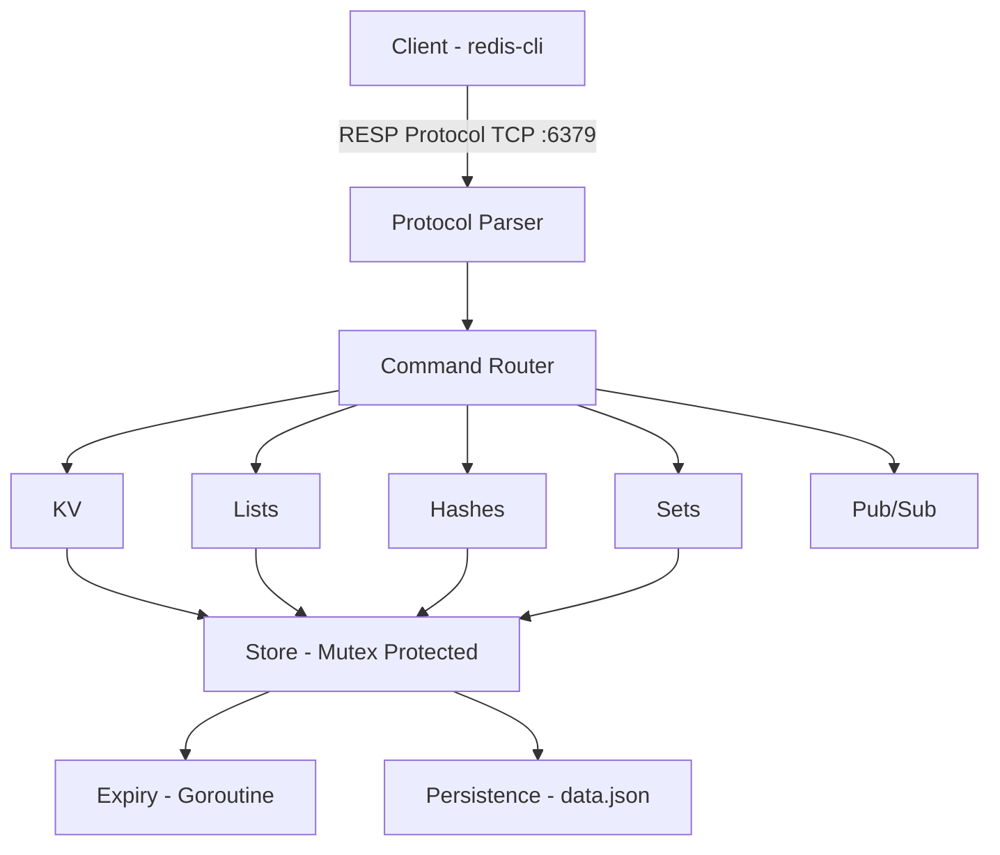

# LiteKV

Redis-compatible in-memory database built from scratch in Go - no external database libraries. Supports RESP protocol, works with `redis-cli` and any Redis client library.

## Architecture



## Features

- Full RESP protocol parser (arrays, bulk strings, integers, errors, null)
- Thread-safe with `sync.RWMutex`
- Background TTL expiry cleanup (goroutine + ticker)
- JSON persistence (SAVE/BGSAVE + auto-load on startup)
- Pub/Sub messaging with channel subscriptions
- Pipelining support (buffered writes, flush on empty reader)

## Supported Commands

### Strings
| Command | Example | Description |
|---------|---------|-------------|
| `SET` | `SET key value` | Set a key-value pair |
| `GET` | `GET key` | Get value by key |
| `DEL` | `DEL key` | Delete a key |
| `EXISTS` | `EXISTS key` | Check if key exists (1/0) |
| `SETEX` | `SETEX key 60 value` | Set with expiration (seconds) |
| `EXPIRE` | `EXPIRE key 10` | Set TTL on existing key |
| `TTL` | `TTL key` | Get remaining TTL (-1 no expiry, -2 not exists) |

### Lists
| Command | Example | Description |
|---------|---------|-------------|
| `LPUSH` | `LPUSH mylist value` | Push to head |
| `RPUSH` | `RPUSH mylist value` | Push to tail |
| `LPOP` | `LPOP mylist` | Pop from head |
| `RPOP` | `RPOP mylist` | Pop from tail |
| `LRANGE` | `LRANGE mylist 0 -1` | Get range of elements |
| `LLEN` | `LLEN mylist` | Get list length |

### Hashes
| Command | Example | Description |
|---------|---------|-------------|
| `HSET` | `HSET user name haseeb` | Set hash field |
| `HGET` | `HGET user name` | Get hash field |
| `HDEL` | `HDEL user name` | Delete hash field |
| `HGETALL` | `HGETALL user` | Get all fields and values |
| `HKEYS` | `HKEYS user` | Get all field names |
| `HLEN` | `HLEN user` | Get number of fields |

### Sets
| Command | Example | Description |
|---------|---------|-------------|
| `SADD` | `SADD myset value` | Add member to set |
| `SREM` | `SREM myset value` | Remove member |
| `SISMEMBER` | `SISMEMBER myset value` | Check membership (1/0) |
| `SMEMBERS` | `SMEMBERS myset` | Get all members |
| `SCARD` | `SCARD myset` | Get set size |

### Pub/Sub
| Command | Example | Description |
|---------|---------|-------------|
| `SUBSCRIBE` | `SUBSCRIBE channel` | Subscribe to channel |
| `UNSUBSCRIBE` | `UNSUBSCRIBE channel` | Unsubscribe from channel |
| `PUBLISH` | `PUBLISH channel message` | Publish message to channel |

### Persistence
| Command | Description |
|---------|-------------|
| `SAVE` | Synchronous save to disk |
| `BGSAVE` | Background save to disk |

### Other
| Command | Description |
|---------|-------------|
| `PING` | Returns PONG |

## Benchmarks

Tested with `redis-benchmark -p 6379 -t set,get,lpush -n 10000 -c 50`:

| Command | Throughput | Avg Latency | p99 Latency |
|---------|-----------|-------------|-------------|
| SET | 116,279 req/s | 0.277ms | 0.951ms |
| GET | 126,582 req/s | 0.221ms | 0.551ms |
| LPUSH | 50,505 req/s | 0.923ms | 2.527ms |

## Run

```bash
go run cmd/litekv/main.go
```

## Connect

```bash
redis-cli -p 6379
> SET foo bar
OK
> GET foo
"bar"
> SETEX temp 5 hello
OK
> TTL temp
(integer) 4
> LPUSH mylist a b c
(integer) 3
> LRANGE mylist 0 -1
1) "c"
2) "b"
3) "a"
```

## Build

```bash
go build -o litekv cmd/litekv/main.go
./litekv
```

## Project Structure

```
LiteKV/
├── cmd/litekv/main.go           # Entry point
├── internal/
│   ├── server/server.go         # TCP listener + pipelining
│   ├── protocol/resp.go         # RESP parser and serializers
│   ├── store/store.go           # In-memory store (all data structures)
│   ├── commands/commands.go     # Command routing
│   ├── persistence/rdb.go       # JSON persistence (save/load)
│   └── pubsub/pubsub.go        # Pub/Sub channels
├── go.mod
└── README.md
```

## Author

Haseeb Ahmed - [GitHub](https://github.com/haseebahmed248)
